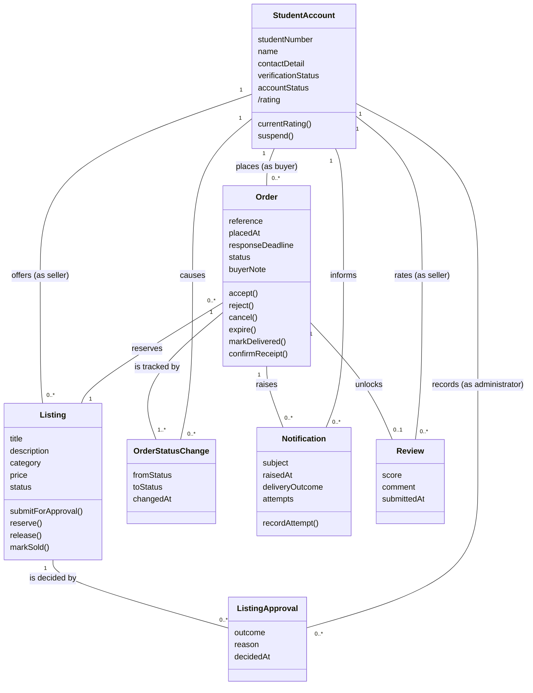

# TRANS-UB — Domain Model

**System under design:** TRANS UB Marketplace system
**Scope of this model:** the vertical slice named in the proposal, sign in → browse → reserve → handoff → confirm → review.

A readable export of the class diagram is kept at [Models/domain-model.svg](domain-model.svg), rendered from [Models/domain-model.mmd](domain-model.mmd). The Mermaid source is embedded below as well.

## How I built this

I started by pulling every noun out of the proposal, the requirements list, the glossary, the quality scenarios and UC-05. That gave me about forty candidates, which is far more than the design needs. Session 06 makes the point that nouns only generate candidates and the scenarios are what select them, so I ran each candidate through the same tests the lecturer used: does the system have to know something distinctive about it, does it have a lifecycle, does it sit in more than one relationship, does it carry a rule. Anything that survived is a class. Anything that only names a screen, a page, a service or a storage mechanism is out, because that belongs to the solution domain and not here.

The one thing I had to keep reminding myself of is that our system does not touch money or the physical exchange. Decision D-001 puts both offline. That killed several candidates that felt obvious at first, Payment and Handover in particular.

## Candidate concepts and what I did with each

Sources: PR = project proposal / problem-and-scope, FR = requirements.md, GL = glossary, UC = UC-05, QS = SCENARIOS MD, CX = system-context.

### Kept as classes

| Candidate | Source | Why it earned a place |
|---|---|---|
| **StudentAccount** | PR, GL, FR-01 | Has identity (student number), a verification outcome and a suspension state, and it sits on both sides of every order. |
| **Listing** | GL, FR-02, UC | Has a lifecycle the whole system depends on: Pending Approval → Available → Reserved → Sold, plus Removed. |
| **ListingApproval** | FR-03, UC precondition 3, UC ext 2f | The administrator's decision on a listing is a fact with a decider, an outcome, a reason and a time. A listing can accumulate more than one of these because an important edit sends it back for approval. |
| **Order** | GL, FR-05, UC | The transaction record. It has its own reference, its own status lifecycle and a 24 hour deadline, and everything downstream hangs off it. |
| **OrderStatusChange** | UC success guarantee 5, UC quality req 4 | Success guarantee 5 says every status change stores who caused it and when, so the history is a thing the system must know, not a side effect of updating a field. |
| **Notification** | UC step 6, UC ext 6a, QS 7 | I hesitated on this one because it looks like a mechanism. It stays because QS 7 requires the system to know whether a message was delivered or is still waiting for retry, and a failed notification must not roll back the order. That outcome is domain knowledge. |
| **Review** | GL, FR-09, UC | One per completed order, tied to a real transaction, and it is the only input to a seller's rating. |

### Kept as roles rather than classes

| Candidate | Source | Decision |
|---|---|---|
| **Student Buyer** | GL, CX | Role of StudentAccount. The same account can buy today and sell tomorrow, so buyer is what an account is doing in one order, not a separate kind of thing. |
| **Student Seller** | GL, CX | Role of StudentAccount, for the same reason. |
| **Platform administrator** | GL, CX, FR-03 | Role of StudentAccount for now. See the open questions, because the glossary says this is our team first and a student moderator later, and those two are not the same thing. |

### Kept as attributes rather than classes

| Candidate | Source | Where it lives |
|---|---|---|
| **Category** | PR objective 1, FR-04 | Attribute of Listing. Buyers filter on it, but the system never has to know anything about a category other than its name, and a category has no lifecycle. |
| **Price** | PR objective 2, FR-04 | Attribute of Listing. |
| **Listing status** | GL, UC | Attribute of Listing. The states are named in the glossary. |
| **Order status** | GL, UC | Attribute of Order, with the history carried by OrderStatusChange. |
| **Seller rating** | GL, FR-09 | Derived attribute of StudentAccount. It is recalculated from Reviews on completed orders, so storing it as a class would give it a life of its own that it does not have. |
| **Student ID verification** | FR-01, GL | Attribute of StudentAccount (verificationStatus). It is a one-off registration check with an outcome, simulated with synthetic data, and nothing else in the slice points at it. |
| **Response deadline** | FR-07, UC success guarantee 3 | Attribute of Order. It is a time, not a thing. |
| **Order reference** | UC success guarantee 4 | Attribute of Order, the identity the buyer is shown. |
| **Buyer note** | UC step 4 | Attribute of Order. |

### Rejected as interface or technology terms

These are the ones the brief asks to strip out. Each is a screen, a page, a component or a piece of infrastructure, and none of them is something a student seller would recognise as part of their world.

| Candidate | Source | Why it is out |
|---|---|---|
| Cart | PR core workflow step 3 | An interface device for collecting items before checkout. UC-05 was written without one and the buyer confirms straight from the listing, so it does not even survive as a mechanism. See the note at the end, the two documents disagree on this. |
| Seller dashboard | PR step 4, UC ext 6a | A screen. The domain fact behind it is that a pending order exists and the seller can see it. |
| Search results page, listing details page | QS 1, QS 2 | Screens. Search is something the system does over Listings, not a thing it holds. |
| Catalogue | PR objective 1 | A view over the approved Listings, not a separate concept. Modelling it would just be a container for something the association already says. |
| Search and listing service, listing-details service, validation service | QS 1, QS 2, QS 4 | Solution components. QS names them as artifacts because that is what the quality-scenario template asks for, but they are machinery. |
| Messaging service | QS 7, CX | External technical service. The domain concept it delivers is Notification and its outcome. |
| Database, free hosting, team repository | PR risks table | Infrastructure. |
| Login, session, password hash | FR-01, PR risks | Access mechanism. The domain concept is a verified, active StudentAccount. |
| Prototype account, synthetic data | FR-01, GL | Project and testing concerns. Real accounts and fake accounts are the same concept to the design. |
| Filter, sort, compare | FR-04 | Actions on a set of Listings, not concepts. |
| WhatsApp group, Facebook post, notice board, group chat | PR problem statement | These describe the problem we are replacing. They are outside the system entirely. |
| Alert, email, SMS, channel | CX, QS 7 | Delivery channels. If we need to record which channel a notice went through it becomes an attribute of Notification, not a class. |
| Order confirmation, report form | PR, FR-10 | Interactions. Confirming is what moves an Order to Completed. |

### Left out on scope, not on principle

| Candidate | Source | Why it is not in this model |
|---|---|---|
| Report, dispute, resolution | FR-10, GL | Real domain concepts with their own lifecycle, but reporting is not part of the vertical slice. They belong in the model once we build FR-10. |
| SRC, University Management | PR, CX, GL | External stakeholders. Neither holds state in the system, and the SRC only receives escalated disputes, which is outside this slice. They stay in the context diagram where they belong. |
| Banned item list | PR risks table | A moderation policy. It constrains what a ListingApproval may approve, so I would model it as a rule rather than a class, and only once FR-03 is built out. |
| Payment, money, mobile money | D-001 | Ruled out by D-001. The system never knows a payment happened, only that the buyer confirmed receipt. |
| Handover | GL, D-001 | Happens offline. What the system knows is the seller marking Delivered and the buyer confirming, which are OrderStatusChange entries. Making Handover a class would claim knowledge we do not have. |

## The classes

**StudentAccount** — a verified UB student. Knows its student number, contact detail, verification outcome and whether it is active or suspended, and can produce its current rating from completed reviews. Plays buyer, seller or administrator depending on the interaction.

**Listing** — one item or service offered by a seller. Knows its title, category, price and current status, and is responsible for moving between Available, Reserved and Sold without ever being Reserved with no order behind it.

**ListingApproval** — an administrator's decision that a listing may or may not go live. Knows the outcome, the reason and when it was made, and which account made it.

**Order** — the record of one buyer reserving one listing from one seller. Knows its reference, when it was placed, its response deadline, its current status and the buyer's note, and carries the rules for accepting, rejecting, expiring, cancelling, delivering and completing.

**OrderStatusChange** — one entry in an order's history. Knows the status it moved from and to, when, and which account caused it. This is what makes a dispute traceable.

**Review** — a rating and comment from a buyer about a seller, attached to exactly one completed order.

**Notification** — a notice the system owes a student about an order. Knows what it is about, when it was raised and whether delivery succeeded, failed or is waiting for retry.

## Associations and multiplicity

Read each end from the opposite class.

| Association | Multiplicity | The rule it states |
|---|---|---|
| StudentAccount (as seller) **offers** Listing | 1 to 0..* | A listing always belongs to exactly one seller. A seller may have any number of listings. |
| Listing **is decided by** ListingApproval | 1 to 0..* | A listing may be waiting with no decision yet, and may collect a second decision if an important edit sends it back (UC ext 2f). |
| StudentAccount (as administrator) **records** ListingApproval | 1 to 0..* | Every decision names the account that made it. |
| StudentAccount (as buyer) **places** Order | 1 to 0..* | A buyer may place many orders over the semester. |
| Order **reserves** Listing | 1 to 1, and Listing to Order 1 to 0..* | An order is always against exactly one listing. A listing may accumulate several orders over time, but at most one may be in Pending, Accepted or Delivered at any moment. That constraint is what stops the double reservation in UC ext 5a. |
| Order **is tracked by** OrderStatusChange | 1 to 1..* | Every order has at least the entry that created it. |
| StudentAccount **causes** OrderStatusChange | 1 to 0..* | The actor behind each change is recorded, which is what UC quality requirement 4 asks for. Expiry is caused by the deadline rather than a person, so this end needs a decision (see open questions). |
| Order **raises** Notification | 1 to 0..* | An order may generate several notices across its life. |
| Notification **informs** StudentAccount | 0..* to 1 | Each notice is addressed to one account. |
| Order **unlocks** Review | 1 to 0..1 | At most one review per order, and only once the order is Completed. This is FR-09 stated as multiplicity. |
| Review **rates** StudentAccount (as seller) | 0..* to 1 | A seller collects reviews. The rating attribute is derived from these. |

## Diagram source (Mermaid)

## Tracing UC-05 through the model

The studio task asks that every scenario step lands on a concept or a relationship, so this is the check that the model is actually big enough.

| UC-05 step | Where it lands |
|---|---|
| 1. Buyer opens an approved listing and asks to reserve it | Listing with status Available, and the ListingApproval that put it there |
| 2. Hub confirms the listing is still Available and the buyer is eligible | Listing.status, StudentAccount.accountStatus, and the seller association (a seller cannot reserve their own listing) |
| 3. Hub explains what reserving means, including that payment and collection are offline | No class. This is wording the interface owes the buyer, and D-001 is why there is nothing in the model to hold it |
| 4. Buyer confirms and may add a note | Order.buyerNote |
| 5. Hub creates the order as Pending, moves the listing to Reserved, records the deadline | Order, Order.responseDeadline, Listing.reserve(), and the first OrderStatusChange |
| 6. Hub tells the seller and shows the buyer the reference, status and deadline | Notification, Order.reference |
| Ext 2a listing no longer available | Listing.status, and the 1 to 1 order-to-listing association refusing a second live order |
| Ext 2e buyer already has a pending order on this listing | The order-to-listing association plus Order.status |
| Ext 5a two buyers confirm at once | The constraint on Order reserves Listing, at most one live order |
| Ext 6a seller cannot be notified | Notification.deliveryOutcome and attempts, order unaffected |
| Follow-on states, accept, reject, expire, cancel, deliver, complete | Order operations, each producing an OrderStatusChange |
| Review after completion | Order unlocks Review, 0..1 |

Every step lands somewhere except step 3, and I am comfortable with that. Step 3 is a disclosure, not a fact the system stores.

## Open modelling questions

1. Is the platform administrator a role of StudentAccount or a separate kind of account? The glossary says our team first and a student moderator later. If it is the team, the account may not be a student at all and the verification attribute makes no sense for it. I modelled it as a role for now, and this is the one I would most like the team to settle.
2. Who causes an OrderStatusChange when an order expires? Nobody does. Either the actor end becomes 0..1, or we accept a system actor, which starts to look like machinery leaking into the domain.
3. Does an important edit produce a second ListingApproval or overwrite the first? The multiplicity above says a second one, which keeps the history, but this depends on the "important edit" rule that UC-05 already flags as undecided.

## Notes for the team

Two things I noticed while harvesting, which I have not changed:

- `Docs/SCENARIOS MD.md` calls the system "Student Hub" throughout. Everything else calls it TRANS-UB, and Student Hub is close to the lecturer's University Service Hub example. Worth a rename before submission.
- The proposal's core workflow has the buyer adding to a cart, while UC-05 was written without one and the failure test in the proposal still mentions updating the cart. UC-05 already lists this as an open issue. I built the model without a cart, following UC-05, so if the team decides there is a cart in the first build this model needs a look.
