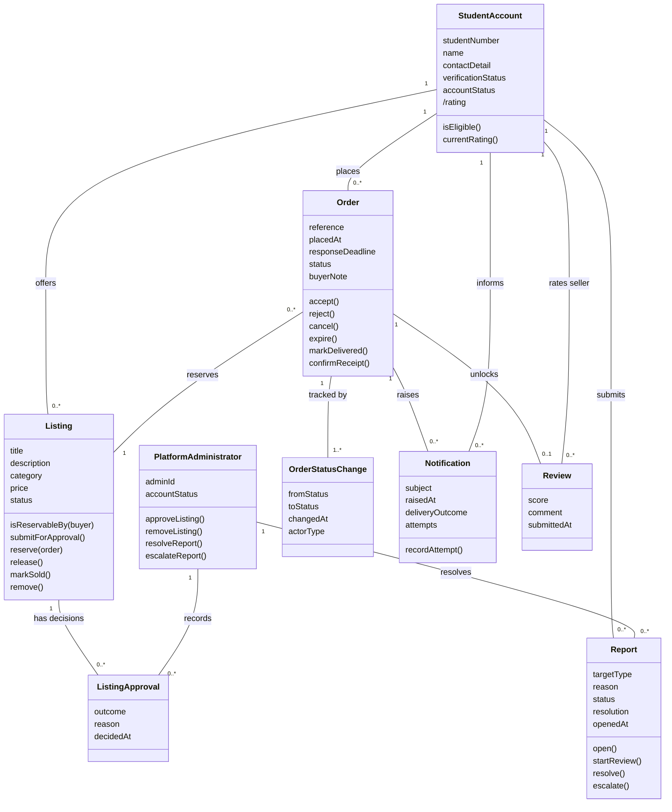

# TRANS-UB — Domain Model

## Scope

This Phase 1 domain model supports the approved marketplace baseline: registration eligibility, approved listings, direct reservation, seller response, expiry/cancellation, delivery/completion, review and report handling.

Payment and physical handover are deliberately absent as domain classes because Decision D-001 places both outside TRANS-UB.

## Core classes and responsibilities

| Class | Responsibility |
|---|---|
| `StudentAccount` | Stores student identity, verification/account status and derived seller rating; plays buyer or seller role. |
| `PlatformAdministrator` | Records moderation decisions and resolves/escalates reports; does not require student verification in the model. |
| `Listing` | Stores listing details and owns listing lifecycle rules. |
| `ListingApproval` | Records administrator approval/rejection decision, reason and time. |
| `Order` | Owns transaction lifecycle, response deadline and buyer note. |
| `OrderStatusChange` | Stores each transition and its cause type (`User` or `System`). |
| `Notification` | Stores notification subject, delivery outcome and retry attempts. |
| `Review` | Stores one rating/comment linked to one Completed order. |
| `Report` | Stores reported target, reason, lifecycle status and resolution/escalation. |

## State vocabulary

**Listing:** Pending Approval → Available → Reserved → Sold; `Removed` is a moderation/withdrawal terminal state.

**Order:** Pending → Accepted → Delivered → Completed, with Rejected, Expired and Cancelled alternatives.

**Report:** Open → Under Review → Resolved or Escalated.

## Key rules reflected by the model

- A Listing belongs to one seller.
- A successful reservation creates one Pending Order and moves Listing Available → Reserved.
- At most one live reservation may exist for a Listing.
- Rejected, Expired or Cancelled releases Listing back to Available.
- Completed changes Listing to Sold.
- An Order has one or more OrderStatusChange entries.
- Automatic expiry uses `actorType = System`.
- At most one Review is linked to an Order, and only after Completed.
- Reports may target a listing, account or order and are resolved/escalated by PlatformAdministrator.

## Mermaid source

## Model rationale

Student Buyer and Student Seller remain roles of StudentAccount because the same eligible account can buy and sell. PlatformAdministrator is represented separately because the administrator role is not necessarily a verified student account.

Report is included because FR-10 is part of the Phase 1 baseline and Lab 6 requires the requirements-and-analysis baseline to be mutually consistent.

OrderStatusChange records an `actorType` so automatic 24-hour expiry can be represented without inventing a human actor.
