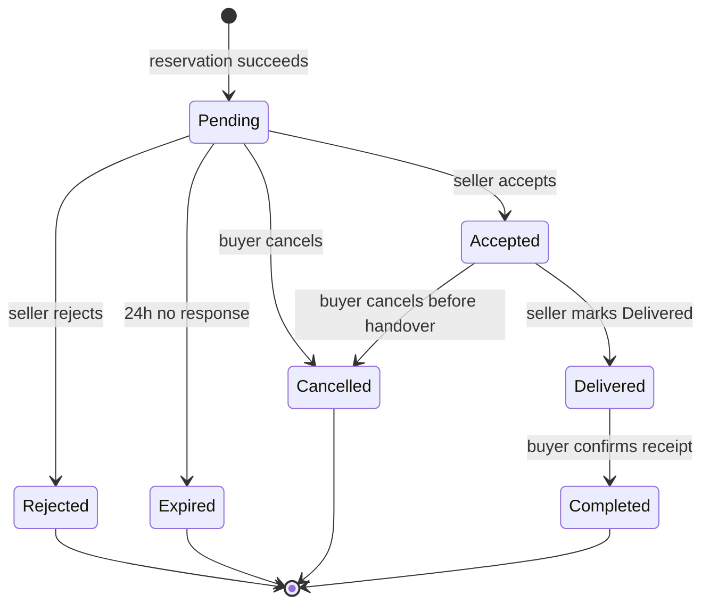

# TRANS-UB — Order State Machine

Primary requirements: FR-05, FR-06, FR-07 and FR-08.

Editable source: `Models/order-state-machine.mmd`  
Readable export required before final tag: `Models/order-state-machine.svg`

## Lifecycle

## Listing effects

| Order transition | Listing effect |
|---|---|
| reservation succeeds → Pending | Available → Reserved |
| Pending → Rejected | Reserved → Available |
| Pending → Expired | Reserved → Available |
| Pending/Accepted → Cancelled | Reserved → Available |
| Accepted → Delivered | remains Reserved |
| Delivered → Completed | Reserved → Sold |

## Guards and rules

- A reservation can only create Pending when the Listing is currently Available.
- Only one live reservation may exist for the same Listing.
- Expiry occurs automatically after 24 hours without seller response.
- Completed is only reachable from Delivered.
- Review eligibility begins only when Order is Completed.