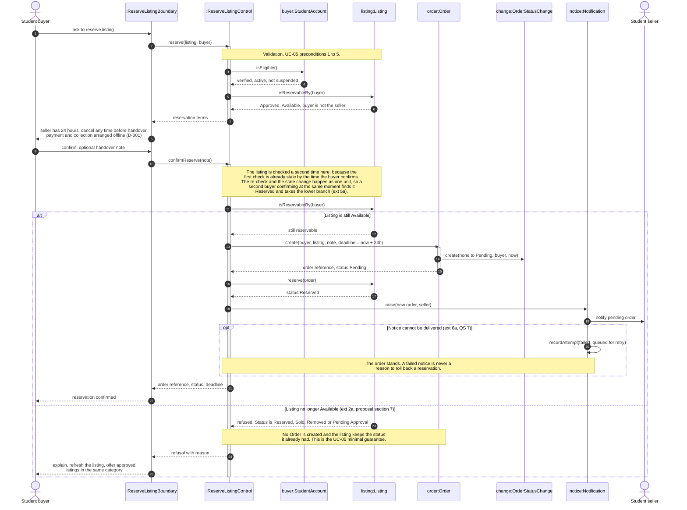

# TRANS-UB — Sequence Model for the Core Use Case

**Use case modelled:** UC-05, Reserve an available listing ([Docs/use-case/TRANS_UB_UC05_Reserve_Listing_Fully_Dressed.md](../Docs/use-case/TRANS_UB_UC05_Reserve_Listing_Fully_Dressed.md))
**Primary requirement:** FR-05, reserve or order an item. Also touches FR-01, FR-03 and FR-07.
**Lab 05, studio item 00-25.**

Editable source: [Models/sequence-core-use-case.mmd](sequence-core-use-case.mmd). Readable export: [Models/sequence-core-use-case.svg](sequence-core-use-case.svg). The source is embedded below as well.

## Why this use case

The proposal already calls the ordering path the vertical slice we build first, because it is the one that creates the transaction record everything else leans on. The review rule, the seller rating and any dispute record all need an Order to exist in a known state. If the interaction here is wrong then FR-08, FR-09 and FR-10 are all wrong behind it, so this is the interaction worth modelling in detail.

## Who is on the diagram and why

The domain model in [Models/domain-model.md](domain-model.md) gives the entities. Session 06 makes the point that the analysis model may add boundary and control responsibilities on top of the domain classes without committing to any framework, so I added two:

| Lifeline | What it is | Why it is there |
|---|---|---|
| Student buyer | Actor | Starts the interaction. |
| `:ReserveListingBoundary` | Boundary | Collects the request and the confirmation, and shows the terms and the result. It holds no rules. |
| `:ReserveListingControl` | Control | Coordinates this one use case: run the checks, create the order, move the listing, raise the notice. |
| `buyer:StudentAccount` | Entity | Answers whether the buyer is verified, active and not suspended. |
| `listing:Listing` | Entity | Owns its own status and answers whether it can be reserved by this buyer. |
| `order:Order` | Entity | Created during the interaction. Holds the reference, the status and the 24 hour deadline. |
| `change:OrderStatusChange` | Entity | Created by the Order. The first history entry, with the actor and the time. |
| `notice:Notification` | Entity | Created during the interaction. Holds whether delivery succeeded or is queued for retry. |
| Student seller | Actor | Receives the notice. Does not act inside this use case. |

Order, OrderStatusChange and Notification do not exist when the interaction starts. They come into being at the messages labelled `create(...)` and `raise(...)`.

## Validation and rules the diagram carries

| # | Rule | Where it shows on the diagram | Traces to |
|---|---|---|---|
| 1 | The buyer must be verified, active and not suspended | `isEligible()` on buyer:StudentAccount | FR-01, UC-05 preconditions 1 and 2, ext 2d |
| 2 | The listing must be Approved and Available | first `isReservableBy(buyer)` | FR-03, UC-05 precondition 3, ext 2b and 2f |
| 3 | A seller cannot reserve their own listing | same call, answered by the Listing because it knows its seller | UC-05 precondition 5, ext 2c |
| 4 | The buyer must be told before committing that payment and collection happen offline | `reservation terms` returned to the boundary | D-001, UC-05 main step 3 |
| 5 | The order is created Pending with a deadline 24 hours out | `create(buyer, listing, note, deadline = now + 24h)` | FR-07, UC-05 success guarantee 3 |
| 6 | The listing moves to Reserved and only one live order may exist against it | `reserve(order)`, and the note on the re-check | FR-05, UC-05 success guarantee 2, ext 5a |
| 7 | Every status change stores who caused it and when | `create(none to Pending, buyer, now)` on OrderStatusChange | UC-05 success guarantee 5, quality requirement 4 |
| 8 | A failed notice does not undo the reservation | the `opt` fragment | UC-05 ext 6a, quality scenario 7 |
| 9 | On refusal no Order exists and the listing keeps its status | the note in the lower branch | UC-05 minimal guarantee |

## The important alternative

The branch I chose is **UC-05 extension 2a, the listing is no longer Available**. Three reasons. It is the failure case the proposal itself names in section 7 as the one we will test. It is the only extension that can fire after the buyer has already committed, which is what makes it worth drawing rather than describing. And it is the branch that has to leave nothing behind, so it is where the minimal guarantee is actually enforced.

The thing the diagram shows that the use-case text does not is **where** the check happens. The listing is checked twice. The first check is what lets the boundary show the terms at all. By the time the buyer reads those terms and confirms, that answer is stale, so the check that decides the outcome is the second one, after `confirmReserve`. Drawing it once at the top would have been tidier and wrong.

Extension 5a, two buyers confirming at nearly the same moment, falls out of the same place. The re-check and the move to Reserved have to happen as one unit. If they do, the second buyer's re-check finds the listing Reserved and takes the same lower branch, so 5a needs no separate fragment. That is recorded as a note rather than a second `alt` on purpose.

## Design rationale

**The choice.** Rules live on the entities, not on the control. `Listing.isReservableBy(buyer)` is answered by the Listing because the Listing is the thing that knows its own status, its approval outcome and who its seller is. The control only decides the order the messages happen in.

**A realistic alternative.** The obvious alternative is a single `ReservationManager` that reads the listing's status, reads the account's status, writes the order, writes the history entry and sends the notice. It would be fewer messages and probably faster to write. Session 06 showed exactly this shape as a fault: the manager owns policy, workflow and delivery, its collaborators become passive data holders, and every new scenario adds another method to the same class. FR-06, FR-07 and FR-08 are all further transitions on the same Order, so that class would keep growing all semester.

**The consequence accepted.** Pushing the rules onto the entities means more messages on the diagram and a control class that looks thin, which can read as though it is not doing much. I accepted that. The payoff is that when the seller-accepts and expiry use cases are modelled they reuse `Order` and `OrderStatusChange` as they are, and only add a control of their own.

**What this cost the domain model.** Two operations were missing and the sequence exposed them. I added `isEligible()` to StudentAccount and `isReservableBy(buyer)` to Listing, and re-exported the class diagram. Everything else on the diagram already existed.

## Diagram source (Mermaid)

## Extensions deliberately left off

UC-05 has seven extensions. Drawing all of them would produce a diagram nobody reads, and the lab asks for one important alternative.

| Extension | Why it is not drawn |
|---|---|
| 2b, listing removed by the administrator after the buyer opened it | Same shape as 2a. The Listing refuses for a different reason, and the only difference is the wording shown to the buyer. |
| 2c, buyer is the seller | Caught by rule 3 in the first check, so it never reaches the branch. |
| 2d, buyer suspended | Caught by rule 1 in the first check. |
| 2e, buyer already has a pending order on this listing | The Listing is already Reserved, so this reaches the lower branch. What differs is that the buyer is shown their existing order instead of a refusal, and that belongs to the boundary. |
| 2f, listing returned to Pending Approval by an important edit | Same shape as 2a again, and it depends on the undecided rule for what counts as an important edit. |
| 5b, the order cannot be stored | A storage failure, which is a solution-domain concern rather than a domain rule. The effect is the same as the lower branch. |

## Open questions this raised

1. Where does the atomicity in the note actually live? Saying the re-check and the status change happen as one unit is a design commitment, and I have not said how. That is a Phase 2 answer, but the diagram is already relying on it.
2. Extension 2e ends in the same branch as 2a but the buyer should see a different result. Either the boundary decides that from the refusal reason, or the control returns the existing order. I left it in the boundary, and it should be checked.
3. The team still has not agreed whether a buyer may hold several pending reservations at once. If the answer is no, that is a tenth rule and it belongs in the first check.
