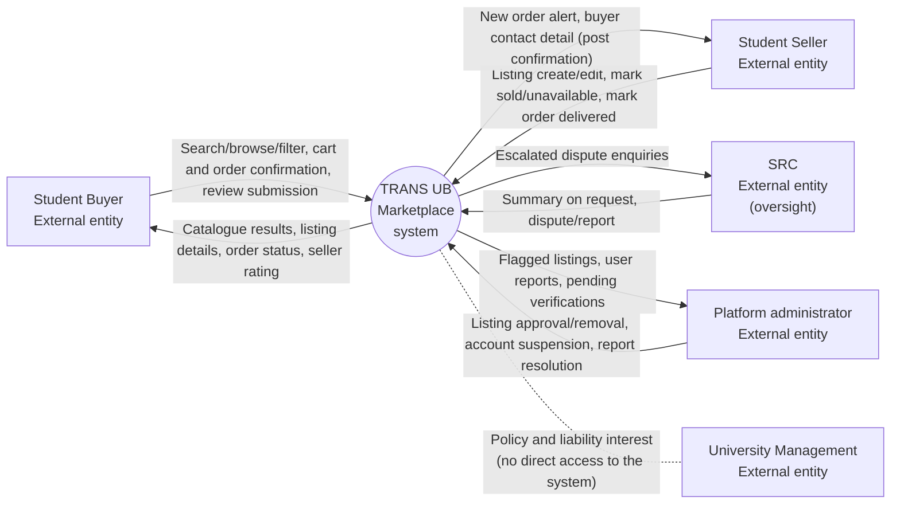

# TRANS-UB System Context Diagram (Level 0)

**System under design:** TRANS UB Marketplace system

A readable export of this diagram is kept at [Models/system-context.svg](system-context.svg), rendered from [Models/system-context.mmd](system-context.mmd). The Mermaid source is also embedded below for readability.

## External entities

| External entity | Role |
|---|---|
| Student Buyer | External entity |
| Student Seller | External entity |
| SRC | External entity (oversight) |
| Platform administrator | External entity |
| University Management | External entity — policy and liability interest, no direct access to the system |

## Data flows

| From | To | Data flow |
|---|---|---|
| Student Buyer | TRANS UB Marketplace system | Search/browse/filter, cart and order confirmation, review submission |
| TRANS UB Marketplace system | Student Buyer | Catalogue results, listing details, order status, seller rating |
| Student Seller | TRANS UB Marketplace system | Listing create/edit, mark sold/unavailable, mark order delivered |
| TRANS UB Marketplace system | Student Seller | New order alert, buyer contact detail (post confirmation) |
| SRC | TRANS UB Marketplace system | Summary on request, dispute/report |
| TRANS UB Marketplace system | SRC | Escalated dispute enquiries |
| Platform administrator | TRANS UB Marketplace system | Listing approval/removal, account suspension, report resolution |
| TRANS UB Marketplace system | Platform administrator | Flagged listings, user reports, pending verifications |
| University Management | — | Policy and liability interest only (shown as a dashed association, no data flow) |

## Diagram source (Mermaid)

